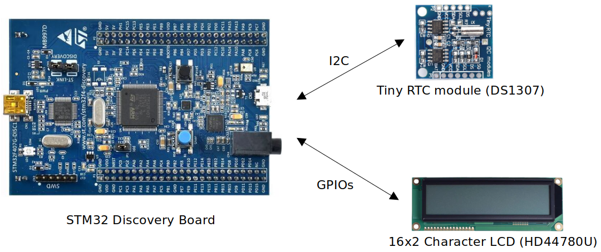
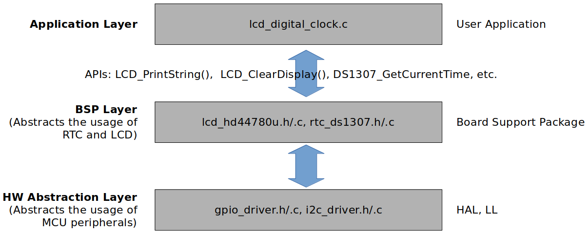

# LCD Digital Clock

This repository contains the source code for the **LCD Digital Clock** development project. Visit the "LCD Digital Clock" section on my website for more details: https://kyungjae.dev/projects/lcd-digital-clock.

## Introduction

* Developed all software layers (HW abstraction layer, BSP layer, application layer) from scratch to implement an LCD Digital Clock
  * The hardware abstraction layer provides the BSP layer with the APIs to control the MCU peripherals such as GPIO, I2C and USART.
  * The BSP layer provides the application layer with the APIs to control the Tiny RTC Module (DS1307) and the 16x2 Character LCD Module (HD44780U).
  * The application layer implements the logic to read the current time and data information from the RTC module and display it on the LCD by using the APIs provided by the underlying software layers.

* Demonstration video: [https://youtu.be/3YQeoxAJBNw](https://youtu.be/3YQeoxAJBNw)

## Development Environment

* Operating system: Ubuntu 22.04 LTS
* Integrated Development Environment (IDE): STM32 CubeIDE Version 1.10.1

## Architecture

### Communication Interfaces

### Software Layers

## List of Files

* Hardware abstraction layer
  * Device header: [stm32f407xx.h](./workspace/lcd_digital_clock/Driver/Inc/stm32f407xx.h)
  * GPIO driver: [stm32f407xx_gpio_driver.h](./workspace/lcd_digital_clock/Driver/Inc/stm32f407xx_gpio_driver.h),  [stm32f407xx_gpio_driver.c](./workspace/lcd_digital_clock/Driver/Src/stm32f407xx_gpio_driver.c)
  * SPI driver: [stm32f407xx_spi_driver.h](./workspace/lcd_digital_clock/Driver/Inc/stm32f407xx_spi_driver.h),  [stm32f407xx_spi_driver.c](./workspace/lcd_digital_clock/Driver/Src/stm32f407xx_spi_driver.c)
  * I2C driver: [stm32f407xx_i2c_driver.h](./workspace/lcd_digital_clock/Driver/Inc/stm32f407xx_i2c_driver.h),  [stm32f407xx_i2c_driver.c](./workspace/lcd_digital_clock/Driver/Src/stm32f407xx_i2c_driver.c)
  * USART driver: [stm32f407xx_usart_driver.h](./workspace/lcd_digital_clock/Driver/Inc/stm32f407xx_usart_driver.h),  [stm32f407xx_usart_driver.c](./workspace/lcd_digital_clock/Driver/Src/stm32f407xx_usart_driver.c)
* BSP layer
  * RTC: [rtc_ds1307.h](./workspace/lcd_digital_clock/Bsp/Inc/rtc_ds1307.h), [rtc_ds1307.c](./workspace/lcd_digital_clock/Bsp/Src/rtc_ds1307.c)
  * LCD: [lcd_hd44780u.h](./workspace/lcd_digital_clock/Bsp/Inc/lcd_hd44780u.h), [lcd_hd44780u.c](./workspace/lcd_digital_clock/Bsp/Src/rtc_ds1307.c)
* Application layer
  * LCD digital clock: [lcd_digital_clock.c](./workspace/lcd_digital_clock/Src/lcd_digital_clock.c)
